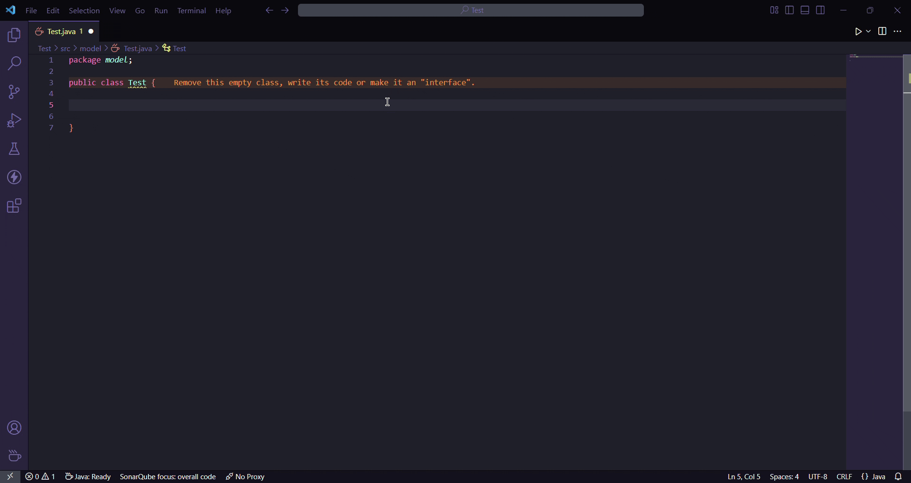

# Java SerialVersion UID Generator

[](LICENSE)
[](https://code.visualstudio.com/)
[](https://marketplace.visualstudio.com/items?itemName=kanin-020.vscode-java-serialuid)

A VS Code extension that automatically generates `serialVersionUID` for Java classes, enums, interfaces, records, and annotation types.

## Features

- Automatic generation of `serialVersionUID` using SHA-1 hashing (matching Java's `serialver` tool)
- Works with all Java type declarations: `class`, `enum`, `interface`, `record`, `@interface`
- Supports K&R and Allman brace styles
- Proper handling of enums with constant terminators (`;`)
- Detects existing `serialVersionUID` to avoid duplicates
- Ignores commented-out fields when checking for existing UIDs
- Code action available in the editor's lightbulb menu
- Automatic activation when Java files are detected

## Preview



## Installation

### From VS Code Marketplace

1. Open VS Code
2. Go to Extensions (`Ctrl+Shift+X`)
3. Search for "Java SerialVersion UID Generator"
4. Click **Install**

### From VSIX

1. Download the `.vsix` file from [Releases](https://github.com/Kanin-020/vscode-java-serialuid/releases)
2. Open VS Code
3. Run `Extensions: Install from VSIX...` from the Command Palette
4. Select the downloaded `.vsix` file

## Usage

1. Open a Java file with a class, enum, interface, record, or annotation type
2. If no `serialVersionUID` exists, the extension will show a code action (lightbulb icon)
3. Click the lightbulb and select **Generate SerialVersionUID**
4. The field is inserted at the correct position:
   - After the opening brace for classes, interfaces, records, and annotations
   - After the enum constant terminator (`;`) for enums

### Demo Files

The `demo/` directory contains example Java files demonstrating all supported scenarios:

| File                       | Description                                          |
| -------------------------- | ---------------------------------------------------- |
| `NormalClass.java`         | Standard K&R style class                             |
| `AllmanStyleClass.java`    | Allman style (brace on next line)                    |
| `EnumType.java`            | Enum with constants and members                      |
| `InterfaceType.java`       | Interface with methods                               |
| `RecordType.java`          | Java record (14+)                                    |
| `AbstractClass.java`       | Abstract class                                       |
| `FinalClass.java`          | Final class                                          |
| `AnnotatedClass.java`      | Class with annotations before declaration            |
| `AnnotationType.java`      | Annotation type (`@interface`)                       |
| `MultipleClasses.java`     | Outer and inner classes                              |
| `ClassWithMembers.java`    | Class with fields and methods                        |
| `ClassWithExistingUID.java`| Class that already has serialVersionUID              |
| `ClassWithCommentUID.java` | Class with commented-out serialVersionUID             |

## Development

### Prerequisites

- [Node.js](https://nodejs.org/) (v18+)
- [VS Code](https://code.visualstudio.com/)

### Setup

```bash
# Clone the repository
git clone https://github.com/Kanin-020/vscode-java-serialuid.git
cd vscode-java-serialuid

# Install dependencies
npm install

# Compile the extension
npm run compile
```

### Run & Debug

1. Open the project in VS Code
2. Press `F5` to launch the Extension Development Host

### Scripts

| Command               | Description                                    |
| --------------------- | ---------------------------------------------- |
| `npm run compile`     | Compile the extension                          |
| `npm run watch`       | Watch for changes and recompile                |
| `npm run lint`        | Run ESLint                                     |
| `npm run lint:fix`    | Run ESLint with auto-fix                       |
| `npm run format`      | Format code with Prettier                      |
| `npm run format:check`| Check formatting without modifying files       |
| `npm run clean`       | Remove build artifacts                         |
| `npm test`            | Run tests                                      |
| `npm run package`     | Build production bundle and package as `.vsix` |

## Contributing

Contributions are welcome! Please feel free to submit a [Pull Request](https://github.com/Kanin-020/vscode-java-serialuid/pulls).

1. Fork the repository
2. Create your feature branch (`git checkout -b feature/amazing-feature`)
3. Commit your changes (`git commit -m 'Add amazing feature'`)
4. Push to the branch (`git push origin feature/amazing-feature`)
5. Open a Pull Request

## License

This project is licensed under the Apache License 2.0 — see the [LICENSE](LICENSE) file for details.

## Author

**Jesús Álvarez (Kanin)** — [GitHub](https://github.com/Kanin-020)
